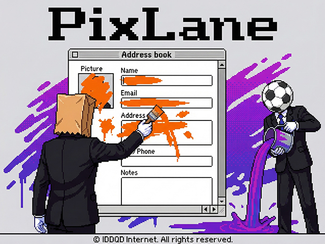

# PixLane (픽스레인)

**PixLane**은 스크린샷을 예쁘게 꾸미거나 민감한 개인정보를 가릴 수 있는 웹 기반 이미지 편집 도구입니다. 복잡한 설치나 로그인 없이, 브라우저에서 바로 사용하세요.

## ✨ 주요 특징

이 프로젝트는 다음과 같은 철학으로 개발되었습니다:

- **서버 데이터 전송 없음 (100% Client-Side)**: 이미지를 포함한 모든 데이터 처리는 사용자의 브라우저 내부에서만 이루어집니다. 서버로 원본 이미지가 전송되지 않아 보안상 안전합니다.
- **설치 불필요**: 앱 스토어 방문이나 프로그램 설치 없이 웹에 접속하여 즉시 사용할 수 있습니다.
- **로그인 불필요**: 회원가입 없이 바로 기능을 이용할 수 있습니다.
- **스크린샷 꾸미기**:
  - 이미지 모서리를 둥글게(Radius) 만들고 그림자(Shadow)를 추가하여 세련된 느낌을 줍니다.
  - 다양한 그라데이션 및 단색 배경을 적용할 수 있습니다.
  - 여백(Padding)을 자유롭게 조절하여 넉넉한 공간감을 줄 수 있습니다.
- **개인정보 가리기 (Blur)**: 이미지의 특정 영역을 드래그하여 흐림 처리를 할 수 있습니다. 공유하기 전 민감한 정보를 가릴 때 유용합니다.

## 🕹️ 사용 방법

1. **이미지 업로드**: 편집할 이미지를 드래그 앤 드롭하거나 클릭하여 파일을 선택합니다.
2. **편집하기**:
   - **Corner Radius**: 모서리 둥글기를 조절합니다.
   - **Padding**: 이미지 주변의 여백을 설정합니다.
   - **Background**: 원하는 배경 패턴이나 색상을 선택합니다.
   - **Blur**: 가리고 싶은 부분을 드래그하여 블러 처리를 합니다.
3. **저장하기**: 'Save' 버튼을 눌러 결과물을 PNG 또는 JPG로 다운로드합니다.

## 🛠️ 기술 스택

- **HTML5 Canvas**: 고성능 이미지 렌더링 및 처리
- **Vanilla JavaScript & jQuery**: 클라이언트 사이드 로직 구현
- **Bootstrap 5**: 깔끔하고 반응형인 UI 레이아웃

## 📄 라이선스

자유롭게 사용하세요.
